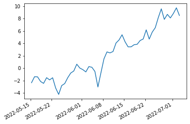
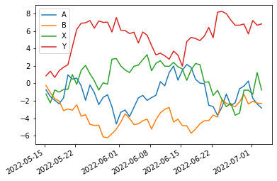

# Pandas library


```python
import pandas as pd
```

# series create, manipulate,querry,delete


```python
arr = [0, 1, 2, 3, 4]
s1 = pd.Series(arr)
s1
```


    0    0
    1    1
    2    2
    3    3
    4    4
    dtype: int64


```python
order = [1, 2, 3, 4, 5]
s2 = pd.Series(arr, index=order)
s2
```


    1    0
    2    1
    3    2
    4    3
    5    4
    dtype: int64


```python
import numpy as np
n=np.random.randn(5)
n
```


    array([-0.57131295, -1.30436093, -1.15195031, -0.77741463,  0.37156066])


```python
n=np.random.randn(5)
index = ['a','b','c','d','e']
s2 = pd.Series(n, index=index)
s2
```


    a    0.281543
    b    0.370618
    c   -0.020243
    d    1.150719
    e    1.911862
    dtype: float64


```python
#create series from dictionary
d={'a':1,'b':2,'c':3,'d':4,'e':5}
s3 = pd.Series(d)
s3
```


    a    1
    b    2
    c    3
    d    4
    e    5
    dtype: int64


```python
# you can modify the index of series
print(s1)
s1.index = ['A','B','C','D','E']
s1
```

    0    0
    1    1
    2    2
    3    3
    4    4
    dtype: int64


    A    0
    B    1
    C    2
    D    3
    E    4
    dtype: int64


```python
# slicing
a=s1[:3]
a
```


    A    0
    B    1
    C    2
    dtype: int64


```python
s1[2:]
```


    C    2
    D    3
    E    4
    dtype: int64


```python
s4 = s1.append(s3)
s4    
```


    A    0
    B    1
    C    2
    D    3
    E    4
    a    1
    b    2
    c    3
    d    4
    e    5
    dtype: int64


```python
s4.drop('e')
```


    A    0
    B    1
    C    2
    D    3
    E    4
    a    1
    b    2
    c    3
    d    4
    dtype: int64


# Series operations


```python
arr1=[0, 1, 2, 3, 4, 5, 7]
arr2=[6, 7, 8, 9, 5]
```


```python
s5=pd.Series(arr2)
s5
```


    0    6
    1    7
    2    8
    3    9
    4    5
    dtype: int64


```python
s6 = pd.Series(arr1)
s6
```


    0    0
    1    1
    2    2
    3    3
    4    4
    5    5
    6    7
    dtype: int64


```python
s5.add(s6)
```


    0     6.0
    1     8.0
    2    10.0
    3    12.0
    4     9.0
    5     NaN
    6     NaN
    dtype: float64


```python
 s5.sub(s6)
```


    0    6.0
    1    6.0
    2    6.0
    3    6.0
    4    1.0
    5    NaN
    6    NaN
    dtype: float64


```python
s5.mul(s6)
```


    0     0.0
    1     7.0
    2    16.0
    3    27.0
    4    20.0
    5     NaN
    6     NaN
    dtype: float64


```python
s5.div(s6)
```


    0     inf
    1    7.00
    2    4.00
    3    3.00
    4    1.25
    5     NaN
    6     NaN
    dtype: float64


```python
s6.median()
```


    3.0


```python
print('median', s6.median())
print('max', s6.max())
print('min', s6.min())
```

    median 3.0
    max 7
    min 0


# Create Dataframe


```python
dates=pd.date_range('today',periods=6)#Define time sequence as index
num_arr=np.random.randn(6,4)# Import numpy random array
columns=['A', 'B', 'C', 'D']#Use the table as the column name
df1 = pd.DataFrame(num_arr, index=dates, columns=columns)
df1
```


<div>
<style scoped>
    .dataframe tbody tr th:only-of-type {
        vertical-align: middle;
    }

    .dataframe tbody tr th {
        vertical-align: top;
    }

    .dataframe thead th {
        text-align: right;
    }
</style>
<table border="1" class="dataframe">
  <thead>
    <tr style="text-align: right;">
      <th></th>
      <th>A</th>
      <th>B</th>
      <th>C</th>
      <th>D</th>
    </tr>
  </thead>
  <tbody>
    <tr>
      <th>2022-05-15 07:58:34.828193</th>
      <td>0.025969</td>
      <td>-0.904468</td>
      <td>-0.145941</td>
      <td>0.923810</td>
    </tr>
    <tr>
      <th>2022-05-16 07:58:34.828193</th>
      <td>-1.364648</td>
      <td>0.409998</td>
      <td>1.516345</td>
      <td>-0.753542</td>
    </tr>
    <tr>
      <th>2022-05-17 07:58:34.828193</th>
      <td>1.632572</td>
      <td>3.155310</td>
      <td>-2.308368</td>
      <td>-1.098301</td>
    </tr>
    <tr>
      <th>2022-05-18 07:58:34.828193</th>
      <td>0.351260</td>
      <td>-1.491322</td>
      <td>-1.318231</td>
      <td>1.655517</td>
    </tr>
    <tr>
      <th>2022-05-19 07:58:34.828193</th>
      <td>-0.969997</td>
      <td>0.344537</td>
      <td>1.921398</td>
      <td>1.075617</td>
    </tr>
    <tr>
      <th>2022-05-20 07:58:34.828193</th>
      <td>1.045944</td>
      <td>0.071602</td>
      <td>0.006977</td>
      <td>0.580592</td>
    </tr>
  </tbody>
</table>
</div>


```python
df1.describe()       
```


<div>
<style scoped>
    .dataframe tbody tr th:only-of-type {
        vertical-align: middle;
    }

    .dataframe tbody tr th {
        vertical-align: top;
    }

    .dataframe thead th {
        text-align: right;
    }
</style>
<table border="1" class="dataframe">
  <thead>
    <tr style="text-align: right;">
      <th></th>
      <th>A</th>
      <th>B</th>
      <th>C</th>
      <th>D</th>
    </tr>
  </thead>
  <tbody>
    <tr>
      <th>count</th>
      <td>6.000000</td>
      <td>6.000000</td>
      <td>6.000000</td>
      <td>6.000000</td>
    </tr>
    <tr>
      <th>mean</th>
      <td>0.120183</td>
      <td>0.264276</td>
      <td>-0.054636</td>
      <td>0.397282</td>
    </tr>
    <tr>
      <th>std</th>
      <td>1.148899</td>
      <td>1.604429</td>
      <td>1.616218</td>
      <td>1.087685</td>
    </tr>
    <tr>
      <th>min</th>
      <td>-1.364648</td>
      <td>-1.491322</td>
      <td>-2.308368</td>
      <td>-1.098301</td>
    </tr>
    <tr>
      <th>25%</th>
      <td>-0.721006</td>
      <td>-0.660451</td>
      <td>-1.025158</td>
      <td>-0.420008</td>
    </tr>
    <tr>
      <th>50%</th>
      <td>0.188614</td>
      <td>0.208070</td>
      <td>-0.069482</td>
      <td>0.752201</td>
    </tr>
    <tr>
      <th>75%</th>
      <td>0.872273</td>
      <td>0.393633</td>
      <td>1.139003</td>
      <td>1.037665</td>
    </tr>
    <tr>
      <th>max</th>
      <td>1.632572</td>
      <td>3.155310</td>
      <td>1.921398</td>
      <td>1.655517</td>
    </tr>
  </tbody>
</table>
</div>


```python
df1.head()
```


<div>
<style scoped>
    .dataframe tbody tr th:only-of-type {
        vertical-align: middle;
    }

    .dataframe tbody tr th {
        vertical-align: top;
    }

    .dataframe thead th {
        text-align: right;
    }
</style>
<table border="1" class="dataframe">
  <thead>
    <tr style="text-align: right;">
      <th></th>
      <th>A</th>
      <th>B</th>
      <th>C</th>
      <th>D</th>
    </tr>
  </thead>
  <tbody>
    <tr>
      <th>2022-05-15 07:58:34.828193</th>
      <td>0.025969</td>
      <td>-0.904468</td>
      <td>-0.145941</td>
      <td>0.923810</td>
    </tr>
    <tr>
      <th>2022-05-16 07:58:34.828193</th>
      <td>-1.364648</td>
      <td>0.409998</td>
      <td>1.516345</td>
      <td>-0.753542</td>
    </tr>
    <tr>
      <th>2022-05-17 07:58:34.828193</th>
      <td>1.632572</td>
      <td>3.155310</td>
      <td>-2.308368</td>
      <td>-1.098301</td>
    </tr>
    <tr>
      <th>2022-05-18 07:58:34.828193</th>
      <td>0.351260</td>
      <td>-1.491322</td>
      <td>-1.318231</td>
      <td>1.655517</td>
    </tr>
    <tr>
      <th>2022-05-19 07:58:34.828193</th>
      <td>-0.969997</td>
      <td>0.344537</td>
      <td>1.921398</td>
      <td>1.075617</td>
    </tr>
  </tbody>
</table>
</div>


```python
df1.tail()
```


<div>
<style scoped>
    .dataframe tbody tr th:only-of-type {
        vertical-align: middle;
    }

    .dataframe tbody tr th {
        vertical-align: top;
    }

    .dataframe thead th {
        text-align: right;
    }
</style>
<table border="1" class="dataframe">
  <thead>
    <tr style="text-align: right;">
      <th></th>
      <th>A</th>
      <th>B</th>
      <th>C</th>
      <th>D</th>
    </tr>
  </thead>
  <tbody>
    <tr>
      <th>2022-05-16 07:58:34.828193</th>
      <td>-1.364648</td>
      <td>0.409998</td>
      <td>1.516345</td>
      <td>-0.753542</td>
    </tr>
    <tr>
      <th>2022-05-17 07:58:34.828193</th>
      <td>1.632572</td>
      <td>3.155310</td>
      <td>-2.308368</td>
      <td>-1.098301</td>
    </tr>
    <tr>
      <th>2022-05-18 07:58:34.828193</th>
      <td>0.351260</td>
      <td>-1.491322</td>
      <td>-1.318231</td>
      <td>1.655517</td>
    </tr>
    <tr>
      <th>2022-05-19 07:58:34.828193</th>
      <td>-0.969997</td>
      <td>0.344537</td>
      <td>1.921398</td>
      <td>1.075617</td>
    </tr>
    <tr>
      <th>2022-05-20 07:58:34.828193</th>
      <td>1.045944</td>
      <td>0.071602</td>
      <td>0.006977</td>
      <td>0.580592</td>
    </tr>
  </tbody>
</table>
</div>


```python
df1.tail(3)
```


<div>
<style scoped>
    .dataframe tbody tr th:only-of-type {
        vertical-align: middle;
    }

    .dataframe tbody tr th {
        vertical-align: top;
    }

    .dataframe thead th {
        text-align: right;
    }
</style>
<table border="1" class="dataframe">
  <thead>
    <tr style="text-align: right;">
      <th></th>
      <th>A</th>
      <th>B</th>
      <th>C</th>
      <th>D</th>
    </tr>
  </thead>
  <tbody>
    <tr>
      <th>2022-05-18 07:58:34.828193</th>
      <td>0.351260</td>
      <td>-1.491322</td>
      <td>-1.318231</td>
      <td>1.655517</td>
    </tr>
    <tr>
      <th>2022-05-19 07:58:34.828193</th>
      <td>-0.969997</td>
      <td>0.344537</td>
      <td>1.921398</td>
      <td>1.075617</td>
    </tr>
    <tr>
      <th>2022-05-20 07:58:34.828193</th>
      <td>1.045944</td>
      <td>0.071602</td>
      <td>0.006977</td>
      <td>0.580592</td>
    </tr>
  </tbody>
</table>
</div>


```python
df1.index
df1.columns
```


    Index(['A', 'B', 'C', 'D'], dtype='object')


```python
df1.values
```


    array([[ 0.02596876, -0.90446826, -0.14594054,  0.92381021],
           [-1.36464823,  0.40999845,  1.51634529, -0.75354171],
           [ 1.63257213,  3.1553104 , -2.30836762, -1.09830088],
           [ 0.3512595 , -1.49132232, -1.31823095,  1.65551652],
           [-0.96999711,  0.34453743,  1.92139846,  1.07561666],
           [ 1.0459441 ,  0.07160177,  0.00697692,  0.58059191]])


```python
df1.to_csv('alphabets.csv')
```


```python
df_alphabets=pd.read_csv('alphabets.csv')
df_alphabets.head(3)
```


<div>
<style scoped>
    .dataframe tbody tr th:only-of-type {
        vertical-align: middle;
    }

    .dataframe tbody tr th {
        vertical-align: top;
    }

    .dataframe thead th {
        text-align: right;
    }
</style>
<table border="1" class="dataframe">
  <thead>
    <tr style="text-align: right;">
      <th></th>
      <th>Unnamed: 0</th>
      <th>A</th>
      <th>B</th>
      <th>C</th>
      <th>D</th>
    </tr>
  </thead>
  <tbody>
    <tr>
      <th>0</th>
      <td>2022-05-15 07:58:34.828193</td>
      <td>0.025969</td>
      <td>-0.904468</td>
      <td>-0.145941</td>
      <td>0.923810</td>
    </tr>
    <tr>
      <th>1</th>
      <td>2022-05-16 07:58:34.828193</td>
      <td>-1.364648</td>
      <td>0.409998</td>
      <td>1.516345</td>
      <td>-0.753542</td>
    </tr>
    <tr>
      <th>2</th>
      <td>2022-05-17 07:58:34.828193</td>
      <td>1.632572</td>
      <td>3.155310</td>
      <td>-2.308368</td>
      <td>-1.098301</td>
    </tr>
  </tbody>
</table>
</div>


```python
df1.to_excel('alphabets.xlsx',sheet_name='Sheet1')
df_alphabets2 = pd.read_excel('alphabets.xlsx', 'Sheet1', index_col=None, na_values=['NA'])
df_alphabets2
```


<div>
<style scoped>
    .dataframe tbody tr th:only-of-type {
        vertical-align: middle;
    }

    .dataframe tbody tr th {
        vertical-align: top;
    }

    .dataframe thead th {
        text-align: right;
    }
</style>
<table border="1" class="dataframe">
  <thead>
    <tr style="text-align: right;">
      <th></th>
      <th>Unnamed: 0</th>
      <th>A</th>
      <th>B</th>
      <th>C</th>
      <th>D</th>
    </tr>
  </thead>
  <tbody>
    <tr>
      <th>0</th>
      <td>2022-05-15 07:58:34.828</td>
      <td>0.025969</td>
      <td>-0.904468</td>
      <td>-0.145941</td>
      <td>0.923810</td>
    </tr>
    <tr>
      <th>1</th>
      <td>2022-05-16 07:58:34.828</td>
      <td>-1.364648</td>
      <td>0.409998</td>
      <td>1.516345</td>
      <td>-0.753542</td>
    </tr>
    <tr>
      <th>2</th>
      <td>2022-05-17 07:58:34.828</td>
      <td>1.632572</td>
      <td>3.155310</td>
      <td>-2.308368</td>
      <td>-1.098301</td>
    </tr>
    <tr>
      <th>3</th>
      <td>2022-05-18 07:58:34.828</td>
      <td>0.351260</td>
      <td>-1.491322</td>
      <td>-1.318231</td>
      <td>1.655517</td>
    </tr>
    <tr>
      <th>4</th>
      <td>2022-05-19 07:58:34.828</td>
      <td>-0.969997</td>
      <td>0.344537</td>
      <td>1.921398</td>
      <td>1.075617</td>
    </tr>
    <tr>
      <th>5</th>
      <td>2022-05-20 07:58:34.828</td>
      <td>1.045944</td>
      <td>0.071602</td>
      <td>0.006977</td>
      <td>0.580592</td>
    </tr>
  </tbody>
</table>
</div>


# Visualization in Pandas


```python
#series and dataframe line chart
import numpy as np
%matplotlib inline
ts = pd.Series(np.random.randn(50), index=pd.date_range('today', periods=50))
ts = ts.cumsum()
ts.plot()
```


    <AxesSubplot:>


    

    


```python
df = pd.DataFrame(np.random.randn(50, 4), index=ts.index,
                 columns=['A', 'B', 'X', 'Y'])
df = df.cumsum()
df.plot()
```


    <AxesSubplot:>


    

    


#Remove repeated data using pandas


```python
df = pd. DataFrame({'A': [1, 2, 2, 4, 4, 5, 5, 5, 6, 6, 7, 8, 8]})
df.loc[ df['A'].shift() !=df['A'] ]
```


<div>
<style scoped>
    .dataframe tbody tr th:only-of-type {
        vertical-align: middle;
    }

    .dataframe tbody tr th {
        vertical-align: top;
    }

    .dataframe thead th {
        text-align: right;
    }
</style>
<table border="1" class="dataframe">
  <thead>
    <tr style="text-align: right;">
      <th></th>
      <th>A</th>
    </tr>
  </thead>
  <tbody>
    <tr>
      <th>0</th>
      <td>1</td>
    </tr>
    <tr>
      <th>1</th>
      <td>2</td>
    </tr>
    <tr>
      <th>3</th>
      <td>4</td>
    </tr>
    <tr>
      <th>5</th>
      <td>5</td>
    </tr>
    <tr>
      <th>8</th>
      <td>6</td>
    </tr>
    <tr>
      <th>10</th>
      <td>7</td>
    </tr>
    <tr>
      <th>11</th>
      <td>8</td>
    </tr>
  </tbody>
</table>
</div>


```python

```
